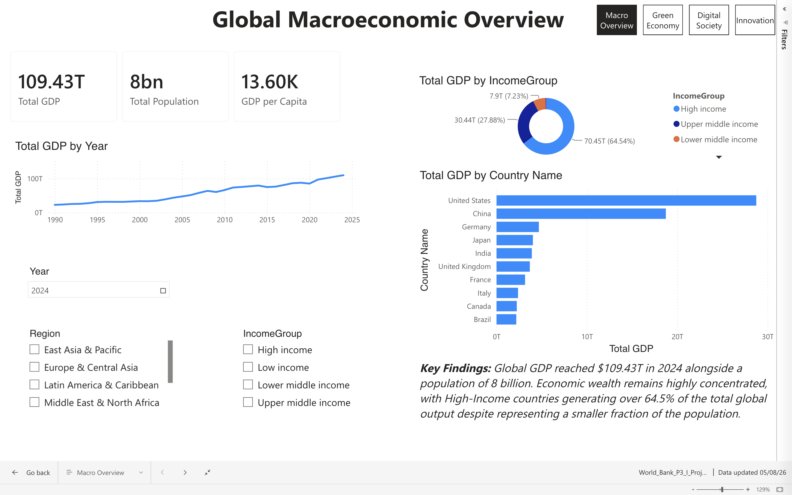
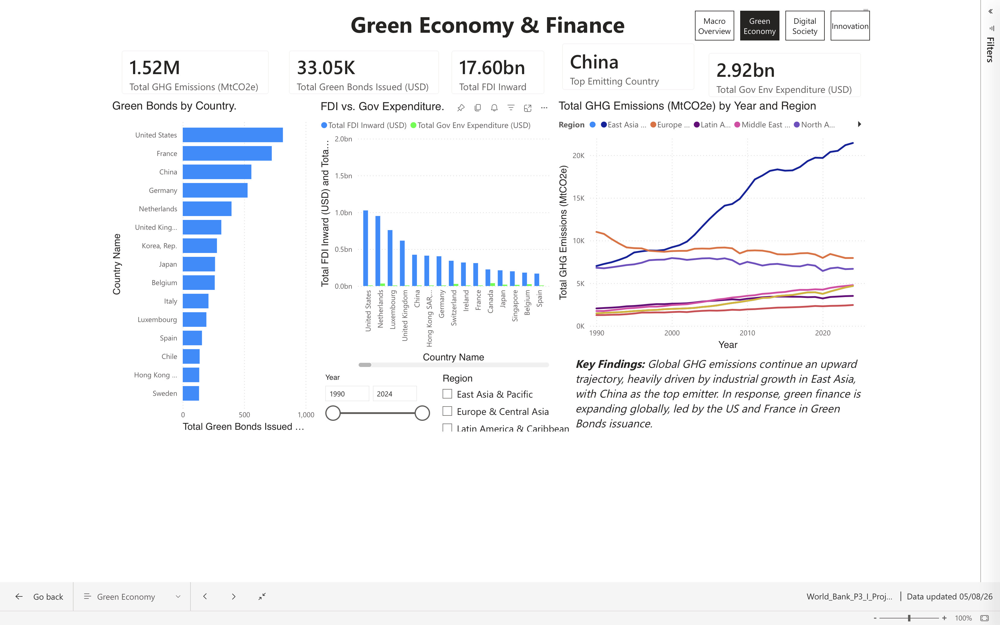
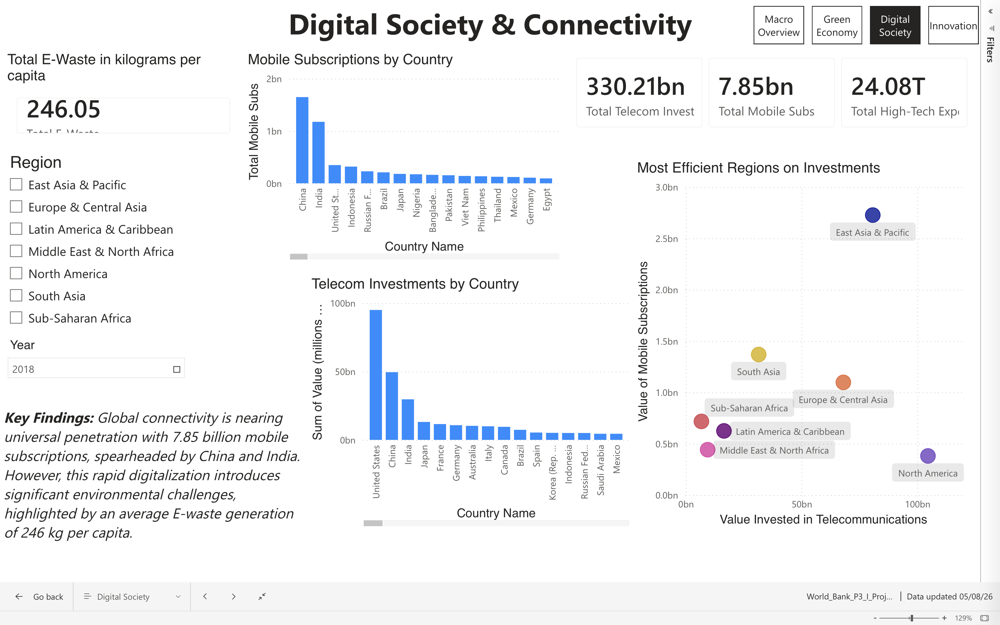
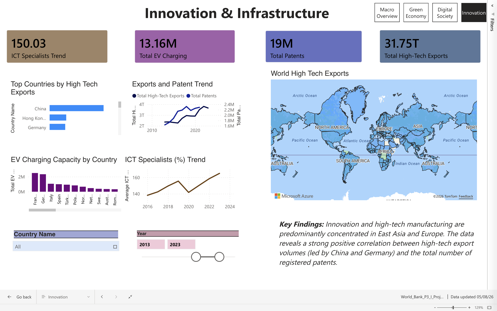
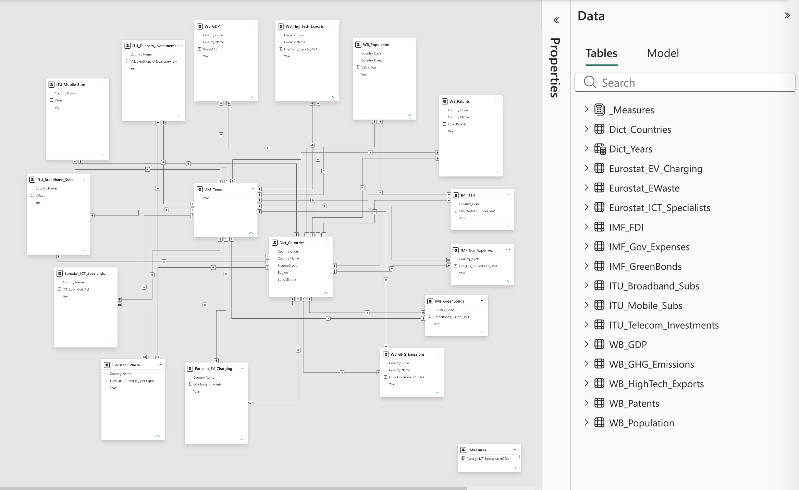

# Global Transition & Sustainability Analytics (Power BI)

An interactive Power BI analytics report exploring the global transition toward a sustainable future through the lens of macroeconomics, digital infrastructure, and green finance.

The project is built on a consolidated data model (**Star Schema**) connecting 15 datasets from 4 global institutions: The World Bank, IMF, Eurostat, and ITU.

---

## Key Insights

* **Macroeconomics & Wealth Inequality:** Global GDP reached a historic peak of **$109.43 Trillion** in 2024. However, wealth remains highly concentrated: high-income countries account for **64.5%** of global economic output.
* **Green Finance & Climate Action:** Foreign Direct Investment (FDI) vastly outpaces direct government environmental expenditures. The United States and France lead in Green Bonds issuance, while China remains the top global GHG emitter.
* **Digital Society & E-Waste:** Global mobile connectivity has reached 7.85 billion subscriptions, driven heavily by China and India. East Asia & Pacific leads in overall telecom investments, while South Asia demonstrates high capital efficiency. On the flip side, global electronic waste has reached an average of **246 kg per capita**.
* **Innovation & Trade:** Data reveals a strong positive correlation between intellectual property generation (19M total patents) and high-tech exports, with Asian economic powerhouses (China, Hong Kong) and Germany dominating global export volumes.






---

## Data Architecture & Model

The project utilizes a **Star Schema** to ensure optimal performance, scalability, and seamless cross-filtering across all dashboards:



### Dimension Tables

* `Dict_Countries.csv` — Master lookup for country names, country codes, regions, and income groups.
* `Dict_Year` — In-model calculated time dimension table for synchronized year-based filtering and Time Intelligence DAX metrics.

### 14 Fact Tables

Connected to the dimension tables via `1-to-Many` (`1:*`) relationships:
* **The World Bank (WB):** GDP, Population, GHG Emissions, Patents, High-Tech Exports.
* **International Monetary Fund (IMF):** Foreign Direct Investment (FDI), Green Bonds, Government Environmental Expenses (COFOG).
* **Eurostat:** E-Waste per capita, ICT Specialists, Electric Vehicle (EV) Charging Capacity.
* **International Telecommunication Union (ITU):** Broadband Subscriptions, Mobile Subscriptions, Telecom Investments.

---

## Local Onboarding & Setup Guide

Follow these steps to connect your local Power BI instance to the shared OneDrive data folder via a dynamic parameter:

### Step 1: Folder Synchronization

Sync or download the project data folder to your local machine. Copy the absolute path to the directory containing all 15 CSV files (e.g., `C:\Users\YourName\OneDrive\PowerBI Project`).

### Step 2: Update the `FolderPath` Parameter

1. Open the project `.pbix` file in Power BI Desktop[cite: 2].
2. In the **Home** tab, click **Transform Data** to launch Power Query Editor.
3. In the left-hand **Queries** pane, locate and select the parameter named **`FolderPath`**.
4. In the main window, paste your copied folder path into the **Current Value** field.
   > **Note:** Ensure there is **no trailing backslash (`\`)** at the end of the directory path.

### Step 3: Refresh & Apply

1. Press **Enter**, then click **Refresh Preview** in the top ribbon.
2. Click **Close & Apply** (top-left). All 15 datasets will connect and load automatically into your model.

---

## Data Cleaning & ETL Highlights

During the ETL phase in Power Query, a specific transformation is required for the ITU datasets:
* Raw value columns contain text formatted with dollar signs and scientific notation (e.g., `$1.99667e+006`).
* **Transformation Step:** After performing the **Unpivot** step, the `$` sign is removed using **Replace Values** (replacing `$` with an empty string). The column is then converted to a **Decimal Number**, which automatically translates scientific notation into standard numerical values (e.g., `1996670`).

---

## UN Sustainable Development Goals (SDGs) Alignment

This report directly tracks metrics aligned with **UN SDGs 4, 8, 9, 10, 11, 12, 13, and 17.**

---

## Project Team

* **Amir Namatov** — Team Lead & Data Architect *(Data Modeling, Star Schema, Macro Overview Page)*
* **Maksim Blazevic** — Financial & Environmental Analyst *(Green Economy & Finance Page)*
* **Joaquim Inácio** — Digital Connectivity Analyst *(Digital Society & Connectivity Page)*
* **Tanjina Sumaiya** — Innovation & Tech Infrastructure Analyst *(Innovation & Infrastructure Page)*

---

## Repository Structure

```text
├── data/                               # 15 Raw CSV datasets (Data Lake)
├── docs/                               # Project documentation & deliverables
│   ├── CONTRIBUTING.md                 # Internal team onboarding & ETL guidelines
│   ├── REPORT.md                       # Full Technical Report & DAX Documentation
│   ├── World_Bank_Presentation_P3I.pdf # Defense presentation
│   └── World_Bank_Report_P3I.docx      # Original Word Document Report
├── PowerBI/                            # Power BI report files
│   └── World_Bank_P3_I_Project.pbix
└── README.md                           # Main repository overview